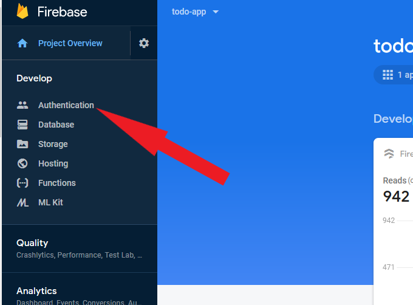
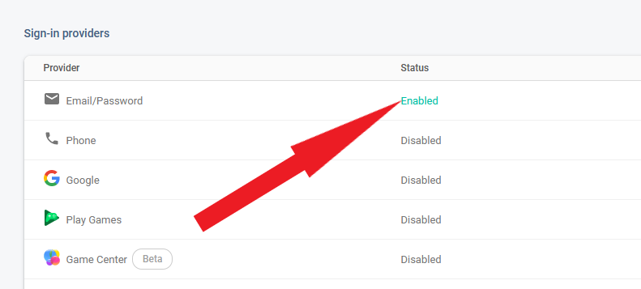
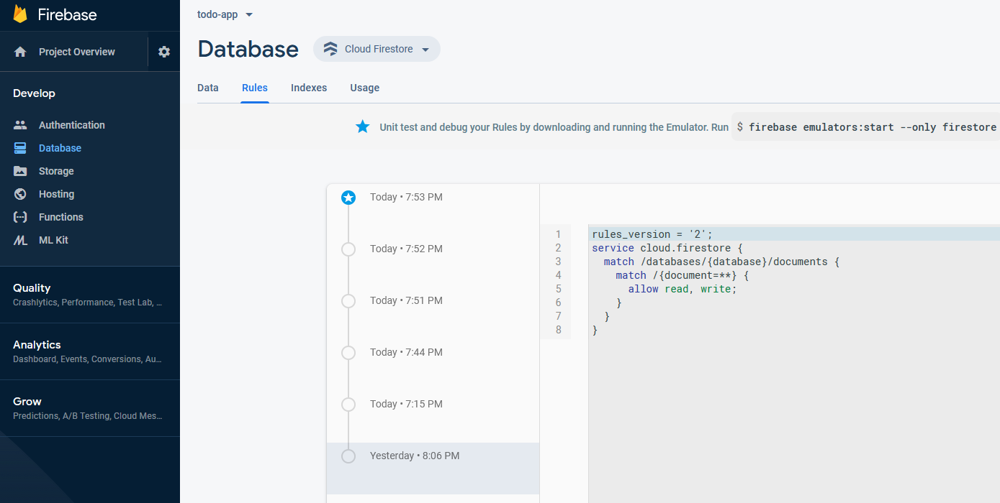
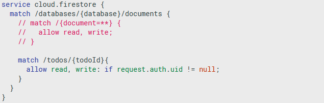

# Firebase Authentication

Et af formålene med authentication, er at bestemme hvilke brugere der har adgang til at hente, ændre, indsætte eller slette bestemte data.

Måske skal alle have læse rettigheder til noget data, mens andet data kun må kunne tilgåes hvis man er logget ind, og måske skal man kun have lov til at oprette et document hvis man har en særlig rettighed.

Der er mange scenarier, og mange metoder og tilgange til authentication. Vi kommer igennem nogle ret grundlæggende funktioner.

## Aktiver Autentication

Det første der skal ske, er at Authentication aktiveres på projektet.

Det sker via firebase consollen.



Derefter skal vi beslutte hvilke metoder det skal være muligt at benytte, for at kunne logge på systemet.
Vi fokuserer udelukkene på **email and password** ind til videre.



## Opret en bruger

Når Authentication er sat til, kan vi manuelt oprette brugere som skal kunne logge på systemet.

Det er ganske enkelt at klikke på **Add user** og udfylde **email** og **password**

Kodeordet vil blive hashet, så det ikke kan læses efterfølgende, så husk hvad du skriver!.

## Knyt Auth til siden

For at få adgang til Authentication på ude i browseren, skal vi hente et nyt firebase modul, som indsættes i `<head>` efter **firebase-app.js** scriptet.

```html
<script src="https://www.gstatic.com/firebasejs/7.2.2/firebase-auth.js"></script>
```

Derudover skal vi have initialiseret auth funktionerne, det sker i det script-tag hvor firebase config og firestore køres i `index.html` dokumentet, her tilføjes auth kodeblokken:

```javascript
// Initialize Firebase
firebase.initializeApp(firebaseConfig);

// referer til authentication service
const auth = firebase.auth();
```

Og da vi kommer til at arbejde med en del forskellige authentication funktioner,giver det mening at oprette en seperat script fil til dem, så opret en fil kaldet **auth.js** og tilføj den til din `index.html`.

`auth.js` skal bare være tom indtil videre.

## Login på siden

Nu hvor der er en bruger på systemet, så skal den bruger kunne logge ind på siden via en login formular.

Så opret en formular med et **brugernavn** og et **kodeord**, samt en button så formen kan sendes.

I `auth.js` filen, knyttes en eventlistner til submit på loginformen, så vi kan gribe data og sende til Authentication.

```javascript
const loginform = document.querySelector("#loginform");
loginform.addEventListener("submit", function(event) {
  event.preventDefault();

  document.querySelector("#loginform_error").textContent = "";

  const email = loginform.username.value;
  const password = loginform.password.value;

  // HUSK VALIDERING !!!

  auth.signInWithEmailAndPassword(email, password)
    .then(function(cred) {
      console.log(cred);
      loginform.reset(); // ryd loginformen
    })
    .catch(function(error) {
      document.querySelector("#loginform_error").textContent = error.message;
    });
});
```

I det viste eksempel kalder vi auth funktionen `signInWithEmailAndPassword` som ganske enkelt kigger i Authentication brugerene efter en bruger med de medsendte oplysninger.

`Catch` funktionen kan benyttes til at udskrive beskeder som serveren sender tilbage, så opret et sted ved din form, hvor det kan udskrives.

Prøv at taste noget forkert, og afprøv hvad der sker hvis f.eks. password ikke er sendt med, eller emailen ikke er en valid email.

Tjek konsollen når det lykkes at logge på med korrekte oplysninger... der får du en masse oplysninger om brugeren.

## Begræns dataadgang

Nu hvor vi har en bruger der kan logge på, så kan vi sætte nogle regler for hvilken data der er tilgængelig.

Det sker på firebase konsollen, under database menuen, og under fanen **Rules**.



Her kan vi bestemme at **todos** collection kun må indlæses hvis man er logget på.



Hvis du allerede er logget på, vil du ikke kunne se hvad reglen gør, så det næste er at oprette en funktion til at logge af.

## Log af systemet

Indsæt en button på siden, og knyt en eventlistener til den i `auth.js` filen.

```javascript
const logout_button = document.querySelector("#logout_button");
logout_button.addEventListener("click", function() {
  auth.signOut().then(function() {
    console.log("brugeren er logget af");
  });
});
```

Efter at have klikket på logud knappen, burde der komme fejl i konsollen i stil med _Missing or insufficient permissions._

Prøv at logge på igen, og se at den fejlbesked forsvinder.

## Opret en bruger

Nu hvor det er muligt at logge af og på, så kunne det være interesant at man kan oprette en bruger igennem hjemmesiden, frem for det kun er igennem Authentication panelet man kan det.

Så opret formular til oprettelse, der indeholder et **email** felt og et **kodeord** felt, det vil også være rigtig god stil at inkludere et **gentag kodeord**. Der skal selvfølgelig være en knap til at skyde formen afsted.

Bind en eventlistener til submit eventen på signup formen i `auth.js` filen, og skriv noget kode der minder om dette:

```javascript
signupform.addEventListener("submit", function(event) {
  event.preventDefault();

  document.querySelector("#signinform_error").textContent = "";

  const email = signupform.username.value;
  const password = signupform.password.value;

  // HUSK VALIDERING, og der burde nok være et "GENTAG PASSWORD" felt!

  auth.createUserWithEmailAndPassword(email, password)
    .then(function(cred) {
      console.log(cred);
      signupform.reset();
    })
    .catch(function(error) {
      document.querySelector("#signinform_error").textContent = error.message;
    });
});
```

Her benyttes funktionen `createUserWithEmailAndPassword` som opretter brugeren på Firebase Authentication servicen.

Det elegante ved den funktion, er at brugeren logges på med det samme, efter det er lykkedes at oprette brugeren.

## lyt på auth.onAuthStateChanged

Ligesom vi kan lytte efter hvornår en collection opdateres, så kan vi også lytte efter hvornår en bruger logger af eller på.

Det kræver lige vi flytter `onSnapshot()` funktionen ud af `scripts.js` og indsætter den i den `auth.onAuthStateChanged()` funktion som skal tilføjes til `auth.js` filen. Ellers vil data udskrives dobbelt.

```javascript
auth.onAuthStateChanged(function(user) {
  if (user != null) {
    db.collection("todos").onSnapshot(
      function(snapshot) {
        let changes = snapshot.docChanges();
        changes.forEach(function(change) {
          if (change.type == "added") {
            renderTodo(change.doc);
          } else if (change.type == "removed") {
            let li = todos.querySelector(`li[data-id="${change.doc.id}"]`);
            todos.removeChild(li);
          }
        });
      },
      function(error) {
        console.log(error.message);
      }
    );

    // vis alle elementer der skal være tilgængelige efter login
    // skjul alle elementer der ikke er relevante for en bruger
  } else {
    // fjern alle elementer i TODO listen
    // skjul elementer der kræver man er logget på
  }
});
```

Læg mærke til at `onSnapshot()` funktionen har nu 2 callbacks, den første kaldes når det er en succes, og den anden kaldes hvis det fejler. På den måde kan vi gribe _Missing or insufficient permissions._ fejlen og istedet for en error i konsol, kan vi blot udskrive en tekst.

Da funktionen kører asynkront, er det faktisk ikke nødvendigt at flytte referencen til `#todos` ind i `auth.js`, fordi den konstant vil eksistere på det tidspunkt auth er færdig med at se på brugeren.

## vis eller skjul data, baseret på login

På nuværende tidspunkt vises alle elementer på skærmen, uanset om man er logget på eller ej.

Det vil give mening at skjule todo-listen og todo-opret-formen hvis man ikke er logget på.

Todo listen bør tømmes helt for elementer, det er ikke nok at sætte en `display:none` på den. Men formularer og logud knappen kan godt vises/skjules via display egenskaben.
