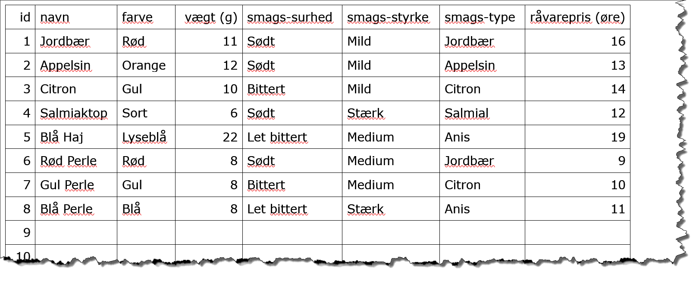

# Udtræk fra firebase.firestore() 

Ind til videre har vi fokuseret på opsætning og grundlæggende brug af firebase.firestore, det næste vi skal dyrke, er hvordan man trækker data ud og hvilke muligheder der er for filtrering og sortering og lign.

Udgangspunktet er en ny collection kaldet bolcher, som I måske kan huske fra tidligere.

Du skal finde på en document struktur til bolcherne, så vi kan oprette en collection af bolcher, hvorpå vi kan afprøve en række forskellige udtræk.



## udskiv data.

Der vil være 10 opgaver, hvor hver opgave skal udkrives i noget HTML, du må selv bestemme hvordan strukturen ser ud, og hvordan hver opgave bliver kaldt.

Det er ikke nødvendigt at opsætte `onSnapshot` funktioner i denne opgave. Du kan eksperimentere med async/await.

```javascript
db.collection("bolcher")
  .get()
  .then(function(snapshot) {
    console.log(snapshot);
  });

(async function() {
  let snapshot = await db.collection("bolcher").get();
  console.log(snapshot);
})();
```

1. Udskriv alle informationer om alle bolcher.

2. Find og udskriv navnene på alle de røde bolcher.

3. Find og udskriv navnene på alle de røde og de blå bolcher.

4. Find og udskriv navnene på alle bolcher, der ikke er røde, sorteret alfabetisk.

5. Find og udskriv navnene på alle bolcher som starter med et “B”.

6. Find og udskriv navene på alle bolcher, hvor der i navnet findes mindst ét “e”.

7. Find og udskriv navn og vægt på alle bolcher der vejer mindre end 10 gram, sorter stigende efter vægt.

8. Find og udskriv navne på alle bolcher, der vejer mellem 10 og 12 gram (begge tal inklusiv), sorteret alfabetisk og derefter vægt.

9. Find og udskriv de tre største (tungeste) bolcher.

10. Udskriv alle informationer om et tilfældigt bolche.
